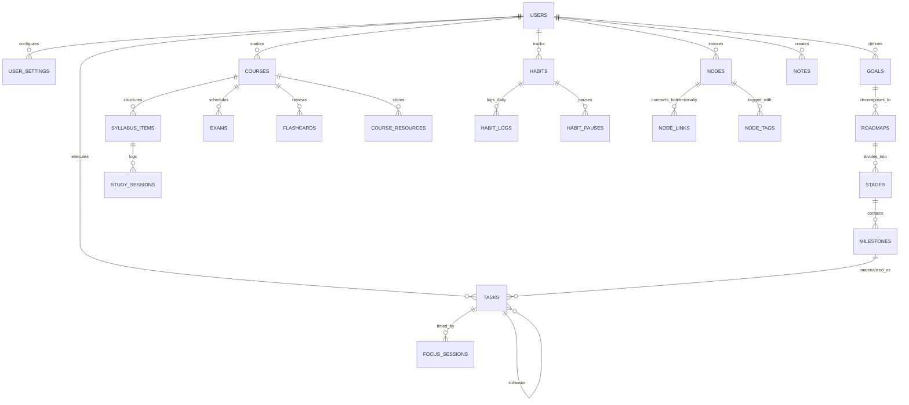
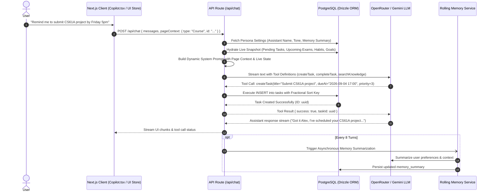

# Personal Intelligence Workspace (PIW)

> **A next-generation, AI-augmented personal operating system uniting strategic life planning, academic mastery, networked knowledge graphs, deterministic task execution, and an emotionally intelligent workspace companion.**

---

## 🌟 Executive Overview

**Personal Intelligence Workspace (PIW)** is an integrated life-management operating system engineered to bridge the gap between high-level human ambition and daily execution. Most personal productivity tools isolate notes from tasks, decouple goals from academic obligations, and treat AI as an external chatbot detached from real workspace context.

PIW solves this fragmentation through a **unified polymorphic entity graph** and a **deeply integrated, context-aware AI Copilot**. Every goal, course, syllabus milestone, note, and task exists in an interconnected relational model, providing a single source of truth for your life, studies, and personal projects.

```
                   ┌─────────────────────────────────────────┐
                   │        STRATEGIC INTENT LAYER           │
                   │  Long-term Directions ➔ Goals ➔ Roadmaps │
                   └────────────────────┬────────────────────┘
                                        │
                                        ▼
┌───────────────────────────────────────┼───────────────────────────────────────┐
│                                       │                                       │
│  🎓 ACADEMIC & STUDY OS               ▼               ⚡ EXECUTION ENGINE      │
│  Courses • Syllabus Items   ┌───────────────────┐    Priority Tasks • Habits │
│  Exams • Flashcard Decks    │ POLYMORPHIC GRAPH │    Focus Sessions • Recurr.│
│  Study Session Logging      │  Bi-directional   │    Deterministic Scoring   │
│                             │    Node Links     │                            │
│  📝 KNOWLEDGE BASE          └─────────┬─────────┘    ⌨️ WORKSPACE CONTROLS   │
│  Markdown Notes • Tags                │              Command Palette (⌘K)    │
│  Referenced Backlinks                 │              Global Hotkeys & Drawers│
└───────────────────────────────────────┼───────────────────────────────────────┘
                                        │
                                        ▼
                   ┌─────────────────────────────────────────┐
                   │       AI COPILOT COMPANION ENGINE       │
                   │  • Ephemeral Page-Aware Context         │
                   │  • Live Workspace Data Hydration        │
                   │  • Background Rolling Memory            │
                   │  • Autonomous Tool Calling (CRUD)       │
                   └─────────────────────────────────────────┘
```

---

## 🏛️ System Architecture & Data Schema

PIW is built on a relational architecture powered by **PostgreSQL** and **Drizzle ORM**, structured into five modular domains:



### 1. Identity & Persona Configuration
- **`users`**: Core user records with timezone, locale, plan tier, and hybrid logical clock (HLC) versioning.
- **`user_settings`**: Configures quiet hours, morning/evening digest times, weekly start days, daily minute budgets, theme, density, and **Copilot Persona parameters** (Assistant Name, User Nickname, Memory Summary, Tone).

### 2. Strategic Intent (Directions, Goals & Roadmaps)
- **`directions`**: Multi-year vision horizons and thematic narratives.
- **`goals`**: Measurable targets categorized by Life Area (`work`, `health`, `project`, `study`, `finance`, `personal`) with target metrics, units, target dates, and confidence indices.
- **`roadmaps` & `stages`**: Sequential multi-stage project decomposition.
- **`milestones` & `milestone_dependencies`**: Concrete, verifiable milestones with "Definition of Done", target due dates, estimated hours, and dependency graph validation.

### 3. Execution & Habit Systems
- **`tasks`**: Hierarchical actionable items supporting parent/subtask nesting, priority rankings (P0–P3), energy states, natural-language due dates, milestone associations, and RFC 5545 recurrence strings (`rrule`).
- **`focus_sessions`**: Deep-work intervals tracking active duration, linked task IDs, and interruption counters.
- **`habits` & `habit_logs`**: Habit tracking with cadence rules (`daily`, `weekly`, `custom`), grace days, streak verification, and backfilling.

### 4. Academic OS
- **`courses`**: Course codes, credits, instructors, target grades, and visual theme tokens.
- **`syllabus_items`**: Granular topic outlines tracked by coverage status (`not_started`, `in_progress`, `covered`, `revised`) and confidence scores (1–5).
- **`exams`**: Exam schedules with custom ramp-up windows (e.g., 14-day countdown preparation alerts) and grade weightings.
- **`study_sessions`**: Structured study logs with pre/post confidence delta scoring and methodology tagging (Pomodoro, Feynman Technique, Active Recall, Practice Papers).
- **`flashcards`**: Spaced repetition flashcard decks with dynamic review intervals.

### 5. Polymorphic Knowledge Graph & Notes
- **`nodes`**: Global polymorphic index representing any workspace entity (Notes, Tasks, Goals, Courses) for rapid fuzzy search and cross-entity mapping.
- **`node_links`**: Bi-directional graph connections (`reference`, `blocks`, `relates_to`) establishing networked knowledge.
- **`notes`**: Rich markdown documents linked into the graph.

---

## 🚀 Key Modules & Capabilities

### 🎯 1. Strategic Intent & Goal Roadmaps
- **Hierarchical Decomposition**: Break down abstract visions into actionable Milestones connected directly to daily Tasks.
- **Life Area Taxonomy**: Color-coded categorization across Work, Health, Study, Finance, and Personal areas.
- **Confidence Tracking**: Log confidence level shifts over time with notes to detect early friction on critical objectives.

### ⚡ 2. Deterministic Task Prioritization Engine
PIW eliminates decision fatigue through an automated **Deterministic Task Scoring Algorithm**:

$$\text{Task Score} = (\text{Priority} \times 10) + \text{Urgency Bonus} - \text{Staleness Penalty}$$

- **Base Priority**: P0 (0 pts) to P3 (30 pts).
- **Due Date Urgency**: $+20$ points if due today; $+30$ points if overdue.
- **Staleness Penalty**: $-1$ point per day elapsed since creation (capped at $-15$) to prevent forgotten backlog clutter.
- **"Now Task" Highlight**: The single highest-scoring item is automatically surfaced on the Today dashboard.
- **Fractional Indexing**: Drag-and-drop ordering using mid-point string keys (`generateKeyBetween`), ensuring zero re-indexing overhead during manual sorting.
- **Natural Language Parsing**: Automatic extraction of dates, times, and priority levels directly from task titles via `chrono-node`.

### 🎓 3. Comprehensive Academic OS
- **Syllabus Mastery Grid**: Visual progress bars and confidence sliders across every lecture topic.
- **Exam Ramp-Up Timelines**: Countdown engine that dynamically surfaces impending exams once they enter their designated ramp window (e.g., 14 days out).
- **Deep Study Session Logger**: Quantitative tracking of learning techniques (Feynman, Active Recall, Pomodoros) measuring confidence before vs. after studying.
- **Spaced Repetition Flashcards**: Flip-card interface with interval adjustments for long-term memorization.
- **Resource Management**: Attach lecture slides, video lectures, and PDF course material with Supabase Storage integration.

### 🧠 4. Polymorphic Knowledge Graph & Notes
- **Bi-directional Backlinks**: Link any Note to specific Goals, Tasks, or Courses. Viewing a Goal or Course automatically displays all referenced notes and incoming connections.
- **Markdown Editor**: Clean typography, code formatting, and live previews.
- **Universal Entity Search**: Rapid multi-entity search supporting cross-domain referencing.

### 🤖 5. Copilot: Context-Aware Workspace Companion
PIW features a deeply integrated AI assistant built with Vercel AI SDK and OpenRouter (Gemini 2.5 Flash / advanced LLMs) that functions as a true co-thinker:

- **Human, Adaptive Persona**: Designed with a warm, observant, and candid character. Adapts brevity and tone based on user state (short answers during late nights; thoughtful reflections when brainstorming).
- **Ephemeral Page Awareness**: Automatically inspects the open note, active goal, or current course. When the user says *"Summarize this"* or *"Break this down"*, Copilot immediately understands the referenced entity without explicit prompt engineering.
- **Live Workspace Snapshot Hydration**: Every conversation turn automatically injects real-time pending tasks, upcoming exams, active habits, and recent notes into context to prevent hallucinations.
- **Background Rolling Memory**: Asynchronously generates concise summaries of user preferences, ongoing projects, and pain points every 8 conversational exchanges without latency impact.
- **Autonomous Tool Execution**:
  - `createTask`: Parses natural language ("remind me to submit the physics lab tomorrow at 4pm") and writes directly to PostgreSQL with correct sort keys and due dates.
  - `completeTask`: Fuzzy-matches task titles or keywords to mark items done.
  - `searchKnowledge`: Queries the polymorphic node index across notes, courses, and goals.
- **Dynamic Assistant Naming**: Seamlessly updates its name or the user's nickname if prompted naturally (e.g., *"Call me Alex"*, *"I'll name you Jarvis"*).

### ⏱️ 6. Focus Mode & Time Tracking
- **Dedicated Deep Work Overlay**: Global Focus Timer (`F` key) supporting stopwatch and Pomodoro workflows.
- **Task Association**: Connect focus sessions directly to pending tasks.
- **Interruption Logging**: Record distractions to analyze focus quality over time.
- **Historical Session Recording**: Stores completed intervals to calculate actual vs. estimated effort.

### 🔄 7. Habit Tracking & Consistency Engine
- **Flexible Cadences**: Daily, weekly, or custom schedules.
- **Streak & Grace Rules**: Built-in grace days per week to maintain realistic streaks without demoralizing resets.
- **One-Click Check-ins & Backfilling**: Rapid toggle on the Today dashboard with support for historical logging.

### ⌨️ 8. Keyboard-First Command Palette
Navigate and operate the entire system without leaving the keyboard:
- `⌘K` / `Ctrl+K`: Universal Command Palette & Search.
- `C`: Open AI Copilot.
- `F`: Launch Focus Timer.
- `Q`: Open Quick Task Capture modal.
- `T`: Navigate to Today Dashboard.
- `K`: Navigate to Tasks View.
- `S`: Navigate to Study & Courses.
- `N`: Navigate to Notes & Knowledge.
- `J`: Navigate to Journal.

---

## 🛠️ Technical Stack

| Layer | Technology | Purpose |
| :--- | :--- | :--- |
| **Framework** | [Next.js 16 (App Router)](https://nextjs.org/) | Server Components, Server Actions, Dynamic Streaming & SSR |
| **Frontend Runtime** | [React 19](https://react.dev/) | Modern UI hooks, Transitions (`useTransition`), optimistic UI updates |
| **Language** | [TypeScript 5](https://www.typescriptlang.org/) | End-to-end type safety across database schemas, actions, and UI |
| **Database & Auth** | [Supabase](https://supabase.com/) & [PostgreSQL](https://www.postgresql.org/) | Relational database, secure authentication, and blob storage |
| **ORM & Migrations** | [Drizzle ORM](https://orm.drizzle.team/) + `drizzle-kit` | Type-safe SQL queries, relational joins, and schema management |
| **AI & LLM Orchestration** | [Vercel AI SDK](https://sdk.vercel.ai/) & [OpenRouter](https://openrouter.ai/) | Multi-turn streaming, structured tool calling, model routing |
| **Styling & UI Components** | [Tailwind CSS v4](https://tailwindcss.com/) + Shadcn UI / Radix | Responsive design system, glassmorphism, fluid typography |
| **State Management** | [Zustand](https://github.com/pmndrs/zustand) | Ultra-lightweight UI state for modals, timer, and copilot drawers |
| **Data Parsing & Utilities** | `chrono-node`, `rrule`, `fractional-indexing`, `date-fns` | NLP date parsing, recurring event logic, and conflict-free reordering |

---

## 🔄 AI Context & Execution Pipeline

The AI Copilot pipeline demonstrates how live workspace data, client-side viewport context, and backend tool execution converge:



---

## 📁 Repository Structure

```
piw-workspace/
├── public/                     # Static assets & icons
├── src/
│   ├── app/                    # Next.js App Router
│   │   ├── (app)/              # Authenticated workspace routes
│   │   │   ├── layout.tsx      # Main application layout with Sidebar & Overlays
│   │   │   ├── page.tsx        # "Today" central command dashboard
│   │   │   ├── plan/goals/     # Strategic Goals, Roadmaps & Milestone views
│   │   │   ├── study/courses/  # Courses, Syllabus breakdown, Flashcards & Exams
│   │   │   ├── tasks/          # Full Task list, filtering & drag-and-drop
│   │   │   └── notes/          # Knowledge base & Markdown note editor
│   │   ├── api/
│   │   │   └── chat/           # Copilot streaming AI endpoint with tool calling
│   │   ├── auth/               # Supabase authentication handlers
│   │   ├── login/              # User authentication interface
│   │   └── globals.css         # Tailwind CSS v4 design tokens
│   ├── components/             # Reusable UI & Feature components
│   │   ├── CommandPalette.tsx  # Global ⌘K command dispatcher
│   │   ├── ConnectionsPanel.tsx# Bi-directional knowledge graph panel
│   │   ├── ContextSetter.tsx   # Ephemeral client-to-copilot context bridge
│   │   ├── Copilot.tsx         # AI Copilot chat drawer & interactive interface
│   │   ├── FlashcardList.tsx   # Spaced repetition study flashcards
│   │   ├── FocusTimer.tsx      # Pomodoro / Stopwatch focus session manager
│   │   ├── HabitTracker.tsx    # Daily habit tracking & streak visualization
│   │   ├── NodeConnector.tsx   # Cross-entity linking modal
│   │   ├── NoteEditor.tsx      # Markdown note editor with real-time save
│   │   ├── QuickCapture.tsx    # Rapid multi-field task capture modal
│   │   ├── RecurrencePicker.tsx# RFC 5545 recurrence rule builder
│   │   ├── ResourceUploader.tsx# Cloud storage attachment manager
│   │   ├── RoadmapView.tsx     # Sequential stage & milestone tree
│   │   ├── Sidebar.tsx         # Navigation rail with status indicators
│   │   ├── SyllabusManager.tsx # Syllabus coverage & confidence matrix
│   │   ├── TaskDrawer.tsx      # Task inspection, subtasks, tags & metadata
│   │   ├── TaskList.tsx        # Drag-and-drop sortable task interface
│   │   ├── TodayView.tsx       # Today's synthesized dashboard view
│   │   └── ui/                 # Atomic Shadcn UI components (Dialog, Sheet, etc.)
│   ├── lib/
│   │   ├── persona.ts          # AI persona prompt builder, heuristics & safety
│   │   ├── scoring.ts          # Deterministic task scoring algorithm
│   │   └── utils.ts            # Class merge and style utilities
│   ├── server/                 # Server-side business logic
│   │   ├── actions/            # Next.js Server Actions (Tasks, Plan, Study, Notes, Habits)
│   │   ├── db/
│   │   │   ├── index.ts        # Database connection client
│   │   │   └── schema.ts       # Complete PostgreSQL schema definitions
│   │   └── services/
│   │       ├── memoryService.ts# Asynchronous rolling conversational memory
│   │       └── settingsService.ts # User settings & persona configuration
│   ├── store/                  # Client-side state stores
│   │   ├── taskStore.ts        # Optimistic task state management
│   │   └── uiStore.ts          # Global UI overlay, timer & copilot states
│   ├── utils/
│   │   └── supabase/           # Server and browser Supabase client factories
│   └── middleware.ts           # Route protection & session validation
├── drizzle.config.ts           # Drizzle ORM configuration & migration setup
└── package.json                # Project dependencies and workspace scripts
```

---

## 🔒 Security, Privacy & Design Integrity

- **Row-Level User Isolation**: Every database query and server action strictly enforces user ownership via authenticated Supabase sessions.
- **Server Action Validation**: Inputs are validated through strong typing and sanitization routines before database mutations.
- **Prompt Injection Defense**: The Copilot engine incorporates heuristic regex and pattern filtering to detect system prompt override attempts, SQL injection keywords, and unsafe payload manipulation.
- **Ephemeral Context Boundaries**: Screen-context payloads passed to the AI Copilot are validated and character-truncated on the server before LLM ingestion.
- **Safe Soft Deletions**: Critical entities utilize `deletedAt` timestamps to preserve relational integrity and prevent accidental data loss.

---

## 📜 License

Private and proprietary. Designed and developed as a Personal Intelligence Workspace.
