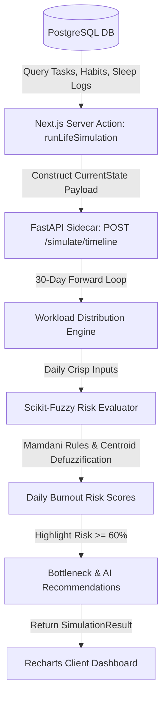

# Technical Architecture & Mathematics: Predictive Life Simulation Engine

This document provides a comprehensive technical breakdown of how predictions, fuzzy logic risk evaluations, and timeline bottleneck recommendations are computed in the **Personal Intelligence Workspace (PIW)** simulation engine.

---

## 1. End-to-End System Pipeline



---

## 2. Input Data Extraction & Normalization

The server action (`src/server/actions/simulation.ts`) queries the PostgreSQL database and normalizes user execution data into three standardized fuzzy inputs:

### A. Task Load ($L_{daily}$)
- **Total Unscheduled Effort**: Sum of estimated task minutes converted to hours:
  $$H_{unscheduled} = \sum \frac{\text{estimateMinutes}}{60}$$
- **Base Unscheduled Daily Load**: $H_{unscheduled}$ distributed over 30 days plus a 4.0-hour baseline overhead:
  $$L_{base} = \frac{H_{unscheduled}}{30} + 4.0$$
- **Scheduled Workload**: Sum of task estimates assigned to a specific due date $d$.
- **Weekend Adjustment**: Workload multiplier factor $W_{factor} = 0.5$ on Saturday/Sunday and $1.0$ on weekdays.
- **Final Daily Load Equation**:
  $$L_{daily}(d) = \min\Big(14.0,\; \big(L_{scheduled}(d) + L_{base}\big) \times W_{factor}\Big)$$

### B. Sleep Deficit ($S_{deficit}$)
- Calculated from the user's last 7 days of `metric_logs` for `Sleep`:
  $$S_{avg} = \frac{1}{N} \sum_{i=1}^{N} \text{sleep\_hours}_i$$
- Evaluated against a baseline target of $8.0$ hours:
  $$S_{deficit} = \max\Big(0.0, \; 8.0 - S_{avg}\Big)$$
- Bounded crisp input universe: $S_{deficit} \in [0.0, 4.0]$ hours.

### C. Habit Adherence ($H_{adherence}$)
- Calculated from active habits and 7-day `habit_logs`:
  $$H_{adherence} = \frac{1}{M} \sum_{j=1}^{M} \min\left(100.0, \; \frac{\text{logged\_days}_j}{7} \times 100\right)$$
- Bounded crisp input universe: $H_{adherence} \in [0.0, 100.0\%]$.

---

## 3. Fuzzy Logic Risk Evaluator Engine (`evaluator.py`)

The evaluation engine uses **Mamdani Fuzzy Inference** via Python `skfuzzy.control`.

### A. Universes of Discourse & Antecedents
- **`task_load` ($x_1$)**: Universe $\mathbf{U}_1 = [0.0, 14.0]$ hours/day. Membership terms: `low`, `average`, `high`.
- **`sleep_deficit` ($x_2$)**: Universe $\mathbf{U}_2 = [0.0, 4.0]$ hours under target. Membership terms: `low`, `average`, `high`.
- **`habit_adherence` ($x_3$)**: Universe $\mathbf{U}_3 = [0.0, 100.0\%]$. Membership terms: `low`, `average`, `high`.

### B. Consequent & Custom Membership Functions
- **`burnout_risk` ($y$)**: Output universe $\mathbf{V} = [0.0, 100.0\%]$.

```text
  1.0 |  Low      Medium       High      Critical
      |  /\        /\          /\          /\
      | /  \      /  \        /  \        /  \
  0.0 +-----+----+----+------+----+------+----+---> Burnout Risk (%)
     0     20   30   50     60   70     80   90  100
```

1. **Low ($\mu_{Low}$)** — Triangular $[0, 0, 30]$:
   $$\mu_{Low}(y) = \max\left(0, \frac{30 - y}{30}\right)$$

2. **Medium ($\mu_{Med}$)** — Triangular $[20, 50, 70]$:
   $$\mu_{Med}(y) = \max\left(0, \min\left(\frac{y - 20}{30}, \frac{70 - y}{20}\right)\right)$$

3. **High ($\mu_{High}$)** — Triangular $[60, 80, 90]$:
   $$\mu_{High}(y) = \max\left(0, \min\left(\frac{y - 60}{20}, \frac{90 - y}{10}\right)\right)$$

4. **Critical ($\mu_{Crit}$)** — Triangular $[80, 100, 100]$:
   $$\mu_{Crit}(y) = \max\left(0, \frac{y - 80}{20}\right)$$

---

### C. Expert Fuzzy Rules Base

The inference engine evaluates 7 domain-expert fuzzy logic rules:

| Rule | Antecedent Condition (IF) | Consequent (THEN) |
|---|---|---|
| **R1** | `task_load` IS `high` **AND** `sleep_deficit` IS `high` | `burnout_risk` IS `critical` |
| **R2** | `habit_adherence` IS `high` **AND** `task_load` IS `average` | `burnout_risk` IS `low` |
| **R3** | `task_load` IS `high` **AND** `habit_adherence` IS `low` | `burnout_risk` IS `high` |
| **R4** | `sleep_deficit` IS `high` **AND** `habit_adherence` IS `low` | `burnout_risk` IS `critical` |
| **R5** | `task_load` IS `low` **AND** `sleep_deficit` IS `low` | `burnout_risk` IS `low` |
| **R6** | `sleep_deficit` IS `average` **AND** `task_load` IS `average` | `burnout_risk` IS `medium` |
| **R7** | `task_load` IS `high` **AND** `sleep_deficit` IS `average` | `burnout_risk` IS `high` |

---

### D. Fuzzy Inference & Defuzzification (Centroid Method)

1. **Rule Firing Strength**:
   For Rule $k$ using AND ($\wedge$), the firing strength $\alpha_k$ is computed using fuzzy MIN:
   $$\alpha_k = \min\big(\mu_{A_k}(x_1), \mu_{B_k}(x_2), \mu_{C_k}(x_3)\big)$$

2. **Fuzzy Output Aggregation**:
   The output fuzzy sets are clipped at $\alpha_k$ and aggregated using fuzzy MAX ($\vee$):
   $$\mu_{aggregated}(y) = \max_{k} \Big(\min\big(\alpha_k, \mu_{Consequent_k}(y)\big)\Big)$$

3. **Centroid (Center of Gravity) Defuzzification**:
   The aggregated output region is converted to a single crisp percentage score $R_{burnout} \in [0, 100]$:
   $$R_{burnout} = \frac{\int_{0}^{100} y \cdot \mu_{aggregated}(y) \, dy}{\int_{0}^{100} \mu_{aggregated}(y) \, dy}$$

---

## 4. Bottleneck Detection & Recommendation Generation

1. **Qualitative Risk Categorization**:
   - $R_{burnout} \ge 75\%$: **Critical Risk** (Bottleneck flagged)
   - $60\% \le R_{burnout} < 75\%$: **High Risk** (Bottleneck flagged)
   - $35\% \le R_{burnout} < 60\%$: **Medium Risk**
   - $R_{burnout} < 35\%$: **Optimal / Low Risk**

2. **Automated Recommendation Logic**:
   - **Peak Workload Warning**: Triggered if bottleneck dates exist. Suggests redistributing scheduled task loads.
   - **Sleep Restoration Tip**: Triggered if $S_{deficit} > 1.0$ hours. Informs user that +1 hr sleep reduces risk by up to 25%.
   - **Habit Stabilization Tip**: Triggered if $H_{adherence} < 60\%$. Recommends building routine consistency to increase stress resilience.
